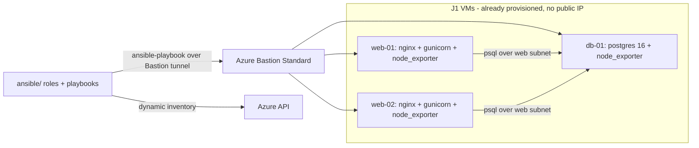

# Azure J4 — Ansible configuration management on a VM fleet

Configuration-as-code for the VM fleet from [azure-j1-vm-fleet](https://github.com/i-robert2/azure-j1-vm-fleet). Ansible turns three blank Ubuntu VMs into a working two-tier app — OS hardening, an **nginx + gunicorn** web tier, a **PostgreSQL** tier, and a **node_exporter** monitoring agent — reached over an **Azure Bastion tunnel**, driven by a **dynamic Azure inventory**, with **vaulted secrets** and a **lint + live-apply CI** pipeline. Reuses J1's VMs as the inventory, so it adds no standing infrastructure.

> Built as a hands-on learning project. The whole flow (dynamic inventory → Bastion tunnel → playbook → idempotency → smoke tests) is verified end-to-end by GitHub Actions against the live fleet.

---

## Architecture



### What the playbook configures
| Role | Hosts | Does |
|---|---|---|
| `common` | all | timezone, chrony, base packages, unattended-upgrades, SSH hardening drop-in, fail2ban |
| `webapp` | web-01, web-02 | nginx reverse proxy + gunicorn + a small Flask `/health` app, `postgresql-client` |
| `database` | db-01 | PostgreSQL 16, app DB + role, `pg_hba` scoped to the web subnet, scram-sha-256 |
| `monitoring_agent` | all | node_exporter on `:9100` via a systemd unit |

---

## Repository layout

```
ansible/
  ansible.cfg                 result_format=yaml, roles_path, ssh control persist
  requirements.yml            collection deps (community.general/postgresql, posix, azure)
  inventory/
    azure_rm.yml              DYNAMIC inventory from Azure (proves acceptance #1)
    hosts.ini                 static map to Bastion tunnel ports (used for the live run)
  group_vars/all/
    main.yml                  shared vars (db_name, db_user, ansible_user)
    vault.yml                 ansible-vault AES256 — the DB password
  roles/
    common/  webapp/  database/  monitoring_agent/
  site.yml                    entrypoint: common+monitoring on all, webapp on web, database on db
  verify.yml                  smoke tests: /health, psql SELECT 1, node_exporter
  .ansible-lint               production profile
.github/workflows/ansible.yml lint gate + live deploy (OIDC + Bastion tunnels)
```

---

## Prerequisites

- The **J1 fleet deployed with a Standard Bastion** (`bastion_sku = "Standard"` in J1) — the Developer SKU can't tunnel, which Ansible needs.
- An **OIDC app registration** with a federated credential for this repo (`repo:<you>/azure-j4-ansible-vm:ref:refs/heads/main`) and Contributor on the subscription.
- Ansible runs on **Linux** (the CI runner, or WSL locally) — it can't run natively from Windows PowerShell.

---

## How it runs (CI)

`.github/workflows/ansible.yml` has two jobs:

1. **lint** — `ansible-lint` (production profile). This is the quality gate; it runs on every PR and push.
2. **deploy** (push to `main`) — the live run:
   - `azure/login@v2` via **OIDC** (no stored Azure secret)
   - opens **one Bastion tunnel per VM** (`web-01:2201`, `web-02:2202`, `db-01:2203`) with `az network bastion tunnel`
   - `ansible-inventory --graph` against the **dynamic Azure inventory** (acceptance #1)
   - `ansible all -m ping` over the tunnels (acceptance #2)
   - `ansible-playbook site.yml` — configures the fleet
   - **idempotency check** — re-runs and fails if the second run reports any change (acceptance #3)
   - `ansible-playbook verify.yml` — smoke tests (acceptance #9)
   - `--tags monitoring` timing (acceptance #8)

GitHub secrets used: `AZURE_CLIENT_ID`, `AZURE_TENANT_ID`, `AZURE_SUBSCRIPTION_ID` (OIDC), `SSH_PRIVATE_KEY` (to reach the VMs), `ANSIBLE_VAULT_PASSWORD` (to decrypt the DB secret).

## Running it locally (WSL / Linux)

```bash
cd ansible
ansible-galaxy collection install -r requirements.yml

# open tunnels in separate shells (one per VM), e.g.:
az network bastion tunnel --name bas-j1-dev-weu-001 -g rg-j1-dev-weu-001 \
  --target-resource-id $(az vm show -g rg-j1-dev-weu-001 -n vm-web-01-j1-dev-weu-001 --query id -o tsv) \
  --resource-port 22 --port 2201

echo "$VAULT_PASSWORD" > .vault-password
ansible -i inventory/hosts.ini all -m ping
ansible-playbook -i inventory/hosts.ini --vault-password-file .vault-password site.yml
ansible-playbook -i inventory/hosts.ini --vault-password-file .vault-password verify.yml
```

To prove the **dynamic** inventory:
```bash
ansible-inventory -i inventory/azure_rm.yml --graph
```

---

## Reusability — what to change

| Change | Where |
|---|---|
| Target resource group / VM names | `inventory/azure_rm.yml`, `inventory/hosts.ini`, workflow `RG`/`BASTION` env |
| Timezone, packages, SSH policy | `roles/common/defaults/main.yml` + template |
| App code | `roles/webapp/files/app.py` |
| Postgres version / DB / subnet | `roles/database/defaults/main.yml`, `group_vars/all/main.yml` |
| node_exporter version | `roles/monitoring_agent/defaults/main.yml` |
| The DB password | re-encrypt `group_vars/all/vault.yml` with `ansible-vault` and rotate the `ANSIBLE_VAULT_PASSWORD` secret |

---

## Security notes (reviewed before publishing)

- **No plaintext secrets in the repo.** The DB password lives in `group_vars/all/vault.yml`, encrypted with **ansible-vault AES256**. The vault password is a GitHub secret, supplied at runtime; the `.vault-password` file is gitignored.
- **No public IPs on the targets.** Ansible reaches the VMs only through the **Azure Bastion tunnel** — the same private path J1 enforces.
- **OIDC for Azure.** The CI authenticates with a federated credential; there is no `AZURE_CLIENT_SECRET`.
- **Least-privilege DB access.** `pg_hba.conf` allows only the web subnet (`10.10.1.0/24`) with `scram-sha-256`; node_exporter and postgres aren't exposed beyond the vNet.
- **SSH hardened by the playbook.** A drop-in disables root login + password auth, sets `MaxAuthTries`, and installs fail2ban.

---

## Best practices demonstrated

- **Dynamic inventory** from cloud tags instead of a hand-maintained host list.
- **Agentless config over a bastion** — no inbound exposure, no SSH from the internet.
- **Idempotency as a CI gate** — the pipeline *fails* if a second run reports changes, forcing proper modules over raw `command`/`shell`.
- **Roles with prefixed variables + capitalized task names** — passes `ansible-lint` on the production profile.
- **Vaulted secrets + runtime password injection** — secrets in the repo without leaking them.
- **Tag-scoped runs** — `--tags monitoring` re-runs just one role quickly.

### Build-it-from-scratch path (if you're learning)

1. **Inventory + connection first.** Get `ansible-inventory --graph` (dynamic) and `ansible all -m ping` green over a Bastion tunnel before writing any role.
2. **`common` role.** Timezone, packages, SSH hardening, fail2ban. Run it; then run it again and confirm **0 changes**.
3. **`webapp` + `database`.** nginx+gunicorn on web, postgres on db; wire the cross-subnet `psql` smoke test.
4. **`monitoring_agent`.** node_exporter via systemd on all hosts.
5. **Vault.** Encrypt the DB password; pass the vault password at runtime.
6. **Lint + CI.** Add `ansible-lint` (production profile) as a gate, then a deploy job that opens the tunnels and runs the playbook + idempotency + smoke tests.

> Gotchas worth internalizing: ansible-lint's production profile is strict (capitalized names, no hyphens in role names, prefixed role vars); `vault_password_file` in `ansible.cfg` breaks lint's syntax-check (pass it at runtime instead); and `stdout_callback = yaml` was removed in community.general v12 — use `result_format = yaml`.

---

## Real-world scenarios where this pattern applies

- **Fleet configuration management** — keep dozens of VMs in a known, hardened, reproducible state from git.
- **Bastion-only estates** — configure servers that have no public IP and must be reached through a jump path.
- **Two-tier app provisioning** — the web/db split with subnet-scoped DB access is a common baseline.
- **Disaster recovery** — `terraform destroy` + `terraform apply` (J1) then `ansible-playbook` rebuilds a working fleet from code in minutes.
- **Drift detection** — the idempotency gate doubles as a "has anything drifted?" check in CI.

---

## Issues we hit (and how we fixed them)

Real problems from building this for real — the root-cause/fix is the useful part.

### `ansible-lint` production profile rejected almost everything
**Symptom:** The lint gate failed with a wall of `name[casing]`, role-name, and var-naming errors.
**Cause:** The **production** profile is strict: task/play/handler names must be **Capitalized**; role names must match `^[a-z][a-z0-9_]*$` (**no hyphens** — `monitoring-agent` was illegal); role variables must be **role-prefixed**; lines ≤ 160 chars.
**Fix:** Renamed `monitoring-agent` → `monitoring_agent`, capitalized all names, prefixed role vars, wrapped long lines.

### `vault_password_file` in `ansible.cfg` broke the lint job
**Symptom:** `ansible-lint` syntax-check failed in CI even though the playbooks were valid.
**Cause:** `ansible.cfg` pointed at a `vault_password_file` that doesn't exist in the lint job (no secrets there).
**Fix:** Removed `vault_password_file` from `ansible.cfg` and passed `--vault-password-file` **at runtime** in the deploy job only.

### Playbook errored: "callback plugin has been removed"
**Symptom:** `ansible-playbook` aborted complaining the `yaml` stdout callback was removed.
**Cause:** `stdout_callback = community.general.yaml` was **removed in community.general v12**.
**Fix:** Use `stdout_callback = default` + `result_format = yaml` instead.

### Couldn't create the vault on Windows
**Symptom:** `ansible-vault` failed with `WinError 1` (blocking I/O); `ansible.parsing.vault` imports the Unix-only `fcntl` module.
**Cause:** No WSL distro installed; Ansible's vault path is Unix-only on this machine.
**Fix:** Generated the AES256 vault blob directly with Python's `cryptography` library and verified a decrypt round-trip. CI (Linux) handles it normally at runtime.

### Ansible needed a Bastion tunnel J1 didn't have
**Symptom:** Ansible couldn't reach the VMs — the Developer Bastion has no CLI tunnel.
**Cause:** Agentless config over Bastion needs `az network bastion tunnel`, which **only the Standard SKU** supports.
**Fix:** Added a selectable `bastion_sku` var to J1 (Developer default | Standard) and deployed J1 with `Standard` for J4. In CI, opened one `nohup az network bastion tunnel … &` per VM to ports 2201–2203 and polled `/dev/tcp` until ready.

---

## Cost

J4 adds **no** infrastructure — it configures J1's VMs. The only cost is J1 running while you test, and a **Standard Bastion** (~€0.19/hr) instead of Developer (Standard is required for tunneling). A deploy-test-destroy session is ~€1. Tear down J1 (`terraform destroy`) when done.

---

## License

MIT — see [LICENSE](LICENSE).
